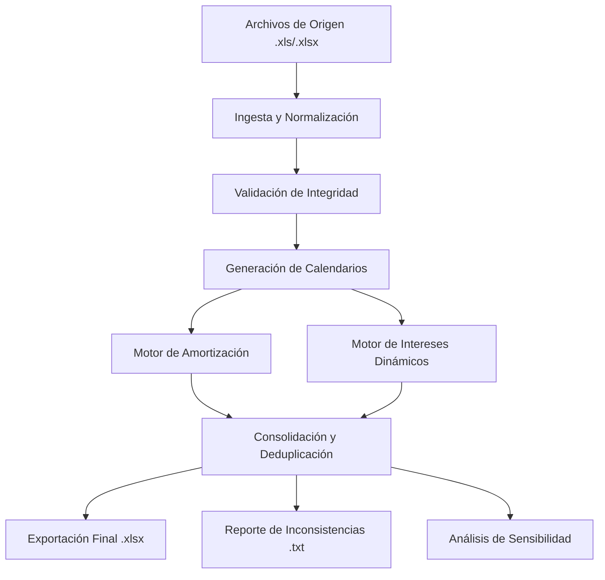

# Pipeline del Proyecto: Generador de Flujos Proyectados

Este documento describe el flujo de datos de extremo a extremo, desde la ingesta de archivos hasta la generación de reportes finales y análisis de sensibilidad.

---

## 1. Arquitectura General del Flujo

El sistema opera como una tubería secuencial dividida en las siguientes etapas:

---

## 2. Etapas Detalladas

### Fase A: Ingesta y Normalización (`modules/file_reader.py`)
*   **Lectura Multi-formato**: Escanea archivos `.xls` intentando leerlos como CSV delimitados (tabulaciones, punto y coma) o Excel binario.
*   **Limpieza de IDs**: Estandariza los identificadores de crédito para asegurar que el cruce entre Oracle, Inventario y Tablas ND sea exacto (maneja notación científica y espacios).

### Fase B: Validación de Integridad (`modules/validators.py`)
*   **Cruce de Archivos**: Verifica que los créditos en Oracle existan en el Inventario Perfil.
*   **Sanidad de Fechas**: Detecta si el vencimiento es anterior al inicio.
*   **Saldos**: Identifica registros con saldo cero que no serán proyectados.

### Fase C: Generación de Calendarios (`modules/calendar_generator.py`)
*   **Cálculo de Fechas**: Determina los hitos de pago basados en la periodicidad (1, 2, 12, ND).
*   **Priorización de Ancla**: Usa la `FECHA PRIMER PAGO` de Inventario como punto de partida absoluto.
*   **Alineación**: Verifica si el vencimiento final coincide con el ciclo periódico.

### Fase D: Ejecución de Motores
*   **Amortización (`modules/amortization_engine.py`)**:
    *   Distribuye el saldo (`SDO_US`).
    *   Si es irregular (ND), busca porcentajes en `tabla_nd.xlsx`.
    *   Si no se encuentra el tramo, cae a código base o distribución uniforme.
*   **Intereses (`modules/interest_engine.py`)**:
    *   **Lookup Dinámico**: Busca la tasa vigente en el archivo de Guías para cada fecha de pago.
    *   **Cálculo**: Aplica métodos de conteo de días (30/360, Actual/360) o frecuencia directa para tasas variables.

### Fase E: Consolidación (`main.py`)
*   **Deduplicación**: Agrupa flujos de capital e intereses que caen el mismo día en una sola fila.
*   **Conversión Moneda**: Calcula equivalentes en moneda local (`amort_mda_real`).

---

## 3. Salidas del Sistema (Outputs)

1.  **`flujo_proyectado.xlsx`**: El libro mayor con todos los pagos futuros.
2.  **`errores_proyeccion.txt`**: Informe de auditoría con instrucciones de "Cómo solucionar" para cada inconsistencia.
3.  **`flujo_sensibilidad.xlsx`**: (Opcional) Análisis de impacto ante choques de tasa y divisas.

---

## 4. Herramientas Complementarias

*   **`inspect_credit.py`**: Buscador interactivo para ver el origen exacto de cada dato de un crédito.
*   **`sensibilidad.py`**: Simulador de escenarios de estrés.
